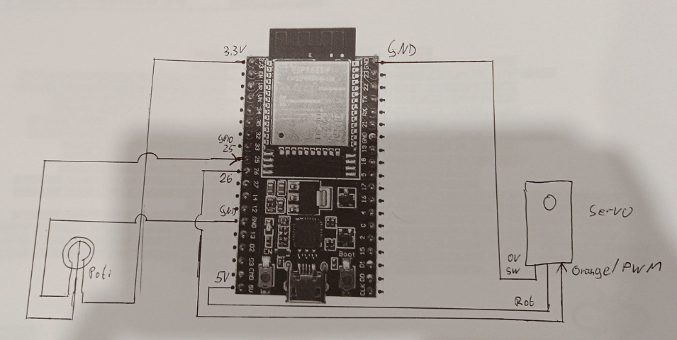

# What is this?
This is an Adruino-sketch (to be used e.g. with an ESP32-Devkit) which will drive a servo-motor back and forth depenending on the value of an attached potentiometer.
This can be used to move a babyswing back and forth and may help them sleep...

This comes without any warranty.

USE AT YOUR OWN RISK.

ALWAYS KEEP AN EYE ON YOUR CHILD!

Take care!

# Connecting:

## Pins used:
- GPIO 25: Input Potentiometer
- GPIO 26: Output PWM Servo-motor
- 3.3V: Vcc for the Potentiometer
- GND: GND for the Potentiometer and Servo
- 5.V: Vcc for the Servo-Motor (Attention: depending on the motor's power you may need an extra power-supply instead of powering it via the Microcontroller-Board!)
